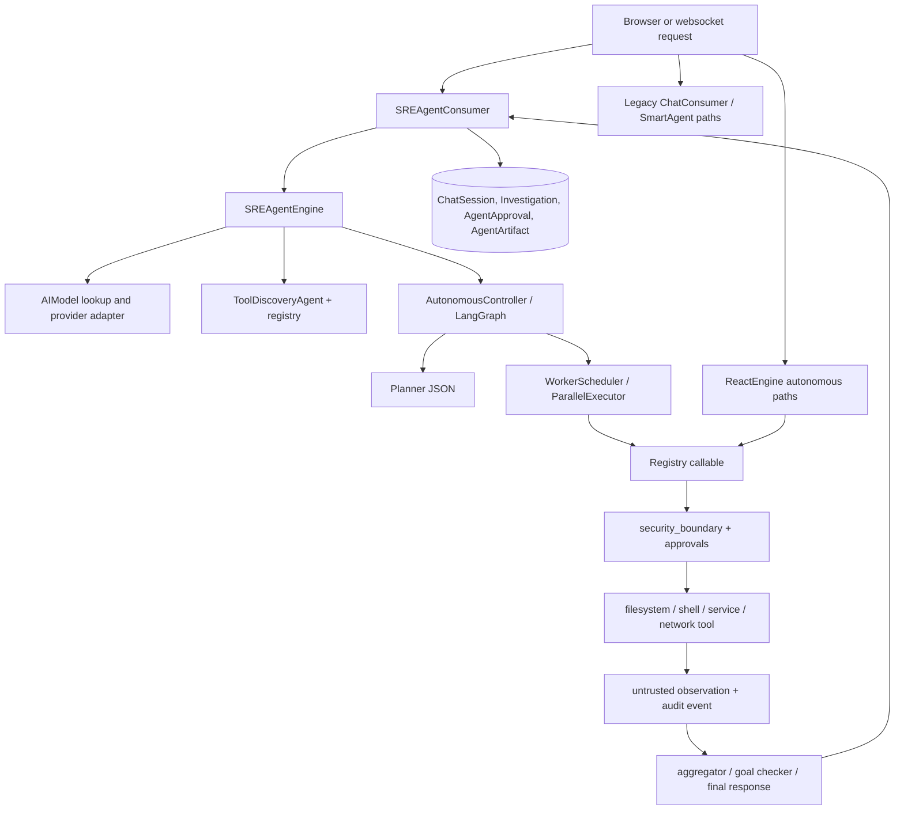

# NeuroSysAI agent intelligence architecture audit

Audit date: 2026-09-27  
Branch inspected: `security/agent-hardening`  
Scope: read-only architecture audit. No runtime files were changed for this report.

## Executive verdict

NeuroSysAI has a substantial execution foundation: registered tools, per-tool metadata, a fail-closed security boundary, database-backed approvals, LangGraph planning, DAG execution, worker delegation, artifacts, and Suricata-related components. The current security suite is evidence that these controls are exercised in isolation. It is not yet evidence that the whole agent is one coherent, resumable, provider-independent system.

The main architectural issue is multiplicity. Guided `SREAgentEngine`/`AutonomousController`, `ReactEngine`, the legacy `ChatConsumer` path, and older `SmartAgent`/MCP paths can reach different prompts, provider adapters, state, and safety behavior. A thesis-ready system should select one canonical execution path and make every other path an explicitly legacy adapter or remove it.

The strongest implemented control is callable-level authorization: `security_boundary.protect_tool` wraps the actual LangChain callable, while `approvals.consume_for` performs exact argument and identity checks. Direct and indirect prompt-injection handling is present, but the detector is a small regex and prompt provenance is still flattened into ordinary text. Action/privilege guard coverage is materially better than the earlier design, yet direct fast-path invocation and multiple entry points remain architectural bypass risks that need end-to-end tests.

This report separates code evidence from inference. No live Groq run, paid-provider run, Suricata run, or authorized network attack run was used to claim runtime behavior.

## Current flow



The canonical-looking guided path persists chat and investigation records, but the live graph state is still assembled as in-memory dictionaries and message lists during a run. A websocket disconnect cancels the task except while an approval lifecycle is pending (`ai_config/ai_config/consumers.py:SREAgentConsumer.disconnect`, lines 1297-1300). That is not a resumable checkpoint protocol.

## Implemented versus conceptual

| Area | Code evidence | Assessment |
|---|---|---|
| Direct prompt-injection block | `ai_config/sre_agent/security_boundary.py:18-24`; `engine.py:332-337`; `react_engine.py:59-67` | Implemented at ingress for known regex patterns. Coverage is heuristic, not a semantic classifier. |
| Indirect injection quarantine | `security_boundary.py:44-49, 94-127`; `react_engine.py:214-223, 236-239` | Implemented for string observations matching the same regex. Structured, binary, encoded, or split-content attacks are not proven covered. |
| Action/privilege guard | `security_boundary.py:51-87`; `approvals.py:118-168` | Implemented at guarded callable for registered tools, with hard blocks, exact hashes, identity checks, expiry, and single-use consumption. |
| Approval lifecycle | `approval_lifecycle.py:20-89`; `consumers.py:1354-1400` | Server-owned timeout and identity-bound decision are implemented. Reconnect/resume and approval recovery are not. |
| Audit logging | `security_boundary.py:30-42`; `approvals.py:62-65, 80-82, 165-167` | Structured log records redact prompts, arguments, results, and hash session/user identifiers. Retention, searchable storage, and tamper evidence are not shown. |
| Planning and evidence gates | `controller.py:85-126, 131-156`; planner/aggregator/goal-checker nodes | Implemented as an in-process graph with retrying JSON parsing and iteration limits. State durability and provider-independent schemas are incomplete. |
| Parallel execution | `parallel.py:45-70, 74-146, 150-180` | Implemented DAG validation, concurrency limit five, duplicate hash tracking, and per-tool safety checks. Cross-run idempotency and mutation conflict control are not shown. |
| Memory | `memory.py:33-75, 82-115, 122-190, 196-234` | Short-term memory is bounded in process; workspace, incident, and conversation memory use Django ORM. Retrieval is keyword based, with no score, TTL, provenance, or staleness policy. |
| Suricata integration | `ai_config/ai_config/utils/eve.py`, `management/commands/start_security_monitor.py`, `security_service.py` | Code paths exist for EVE parsing/monitoring. This audit did not claim live sensor correctness because no capture or authorized traffic test was run. |
| Groq/provider switching | `engine.py:238-323` | Groq adapter exists and requires server-side `AIModel.provider == 'groq'`; no Groq credential was used in this audit. Provider normalization, retry policy, and durable cross-provider resume are absent. |

## Provider and API-limit behavior

`SREAgentEngine._get_llm` first resolves an `AIModel` by `model_id` or name, then silently falls back to the first active model (`engine.py:249-266`). A stale or misspelled client model can therefore switch provider and model rather than fail closed. The adapters use different LangChain classes (`ChatOllama`, `ChatMistralAI`, `ChatGroq`, `ChatOpenAI`, lines 271-323), but there is no canonical provider error envelope, tool-schema capability negotiation, retry/backoff policy, or rate-limit budget in this layer.

The guided path performs multiple model calls: intent/continuation work, planner JSON, worker reasoning, aggregation, goal checking, and final response. The controller retries malformed JSON up to four times (`controller.py:131-156`). `ReactEngine` allows 100 iterations and forces a tool call on every turn (`react_engine.py:138-182`). These are iteration limits, not token, cost, wall-clock, or provider quota limits. A 429, 402, 403, timeout, or context overflow can surface as an exception without a durable continuation point. A provider-independent `AgentState` must record provider/model, request IDs, usage, retry count, and a resumable node boundary.

For Groq testing, configure an `AIModel` row on the server with provider `groq` and run deterministic mocked tests first. Do not pass a key from the browser. The code itself already rejects an unconfigured Groq key (`engine.py:293-300`). No claim of live Groq resistance or quality is made here.

## State, memory, and multi-agent readiness

There are several state representations:

* `TaskState` is a LangGraph `TypedDict` with plan, findings, iteration, approval, evidence, and loop-protection fields (`controller.py:42-63`).
* `WorkerState` is an in-memory dataclass carrying status, evidence, approval, and completed actions (`worker.py:320-390`).
* `ShortTermMemory` is a 25-entry FIFO (`memory.py:33-75`).
* Django models persist chat, investigations, incidents, workspaces, approvals, and artifacts, but they are not a single event-sourced checkpoint stream.

The planner and worker share mutable dictionaries. `ParallelExecutor` limits concurrency but does not provide per-resource locks, transactional mutation groups, or cross-process idempotency. `ReactEngine` keeps its history only in the current `astream` call and has no token-aware truncation (`react_engine.py:133-146`). The multi-agent prompt requires delegation and automatic action (`react_engine.py:96-130`), while `spawn_subagent` is approval-required in the policy (`security_boundary.py:63-65`). This is a safe default, but the orchestrator can still repeatedly request denied work unless the run is stopped and surfaced as a terminal state.

Recommended canonical state (provider independent):

```text
AgentState {
  run_id, session_id, user_id_hash, goal, workspace_scope,
  provider, model, mode, node, status, plan_version,
  messages[], tool_calls[], observations[], evidence[], findings[],
  approval_refs[], budget{tokens, calls, wall_seconds},
  retry_count, idempotency_keys[], audit_refs[], updated_at
}
```

Persist every node transition and tool decision. SQLite or the existing relational database is sufficient for a thesis-scale single deployment: it gives transactions, unique idempotency keys, and inspectable rows. JSON artifacts are useful as an export, not as the authority. A graph database is not justified by the current evidence; the existing DAG is small and relational tables plus JSON fields can represent it.

## Top five gaps

1. **Multiple execution authorities (high).** Guided, ReAct, legacy websocket, and SmartAgent paths have different prompts and state. Consolidate to one canonical path and add a route-level inventory test.
2. **No durable resumable run state (high).** Disconnect, process restart, or provider failure can lose the in-memory graph/worker context. Persist node transitions, tool-call idempotency, and resume tokens.
3. **Provider fallback and quota handling (high).** Unknown model names fall back to the first active model; errors lack normalized retry/cost behavior. Fail closed on selection mismatch and record provider/model/request/usage.
4. **Prompt provenance and injection coverage (medium-high).** User text, history, retrieved incidents, tool output, and delegated output are mostly concatenated into prompts. Replace with typed message provenance and test encoded/split/structured indirect payloads.
5. **Mutation conflict and audit durability (medium-high).** Parallel execution prevents duplicate hashes only inside one executor; artifact/audit records lack an explicit retention, integrity, and resource-lock policy. Add per-resource leases, transaction boundaries, and append-only audit export.

## Thesis freeze plan

### Must fix before the thesis security claim is frozen

* Choose and document the canonical websocket/agent path; mark legacy paths as out of scope or route them through the same guarded callable registry.
* Make model selection fail closed when the requested model is unknown. Add a provider adapter interface with normalized errors and explicit timeout, retry, token, and wall-clock budgets.
* Persist `AgentState` transitions and approval references so a reconnect or worker restart cannot silently discard a pending or partially completed action.
* Add end-to-end tests that invoke the real registered callables for direct injection, indirect file/log injection, denied privilege escalation, approval mismatch, timeout, duplicate execution, and provider errors.
* Define Suricata EVE schema/version handling and run a fixture-based parser test plus an authorized sensor-to-alert integration test. Record exact evidence, timestamps, and limitations.

### Post-thesis roadmap

* Add semantic retrieval with provenance, freshness, and deletion policies after the relational checkpoint model is stable.
* Add per-resource locking and compensating actions for parallel mutations.
* Add provider benchmarking (including Groq) using mocked quota/error fixtures and a small approved live smoke test.
* Replace regex-only injection detection with layered typed-content validation and adversarial corpus evaluation.
* Add operational dashboards for audit events, approval latency, budget consumption, and Suricata correlation.

## Validation performed

The current environment could not reproduce the earlier clean suite: `PYTHONPATH=ai_config pipenv run pytest tests/security -q` produced `69 passed, 1 failed, 16 errors`, because database tests were rejected by pytest-django (`Database access not allowed`) and the EVE integration test reached the same database restriction. A prior correctly configured run reported `75 passed, 0 failed`; that result is unit/security evidence only and does not validate live provider behavior. Migration consistency and extracted `chat3.html` JavaScript syntax checks also passed previously. The full application regression had one unrelated pre-existing failure in `test_file_read_not_found`, so none of these results should be represented as a clean end-to-end pass.
